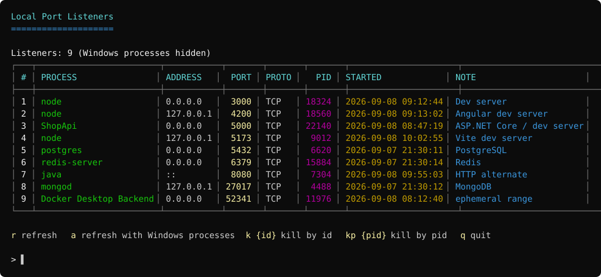
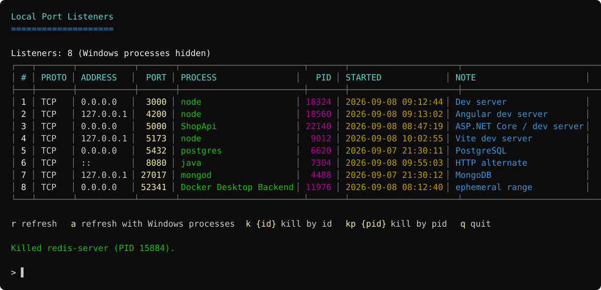
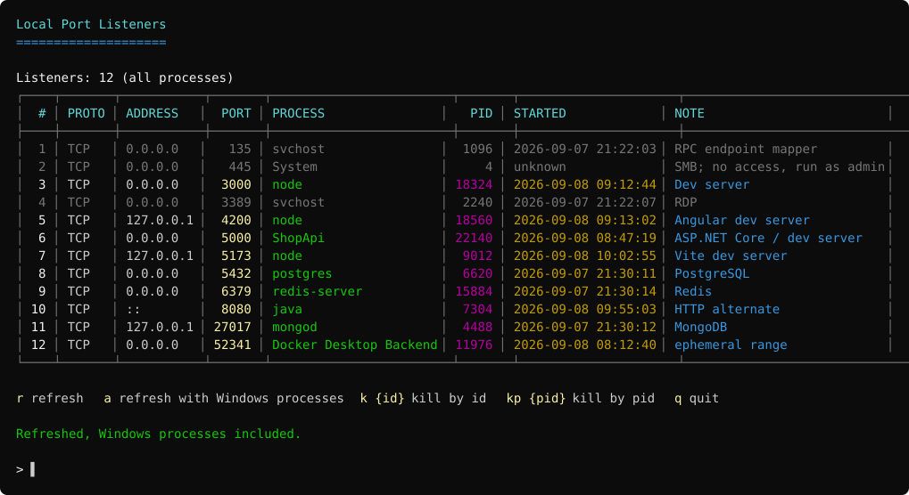

# Local Port Listener

Console tool for Windows that lists every TCP port listener on the machine and lets you kill the owning
process without leaving the terminal. Windows system processes are hidden by default, so what you see is
your own dev stack: node, dotnet, postgres, docker, and friends.



## Features

- All TCP listeners (IPv4 and IPv6) in one table: process name, local address, port, protocol, PID, start time, note.
- Windows system processes filtered out by default, shown dimmed on demand.
- Notes for well-known ports (PostgreSQL, Redis, Vite, ASP.NET Core, ...), the ephemeral range, and for
  processes that need administrator rights to inspect.
- Kill by table id (`k 6`) or straight by PID (`kp 15884`), with the list refreshed right after.
- Kernel PIDs (0-4) are refused instead of throwing.

## Requirements

- Windows
- .NET 9 SDK to build, .NET 9 runtime to run (or a self-contained build, see below)
- Administrator rights are optional: without them some system processes report `no access, run as admin`
  and cannot be killed

## Run

```powershell
dotnet run --project src/LocalPortListener/LocalPortListener.csproj
```

## Commands

| Command    | Action                                                        |
|------------|---------------------------------------------------------------|
| `r`        | refresh the list (Windows processes hidden)                    |
| `a`        | refresh including Windows processes (shown dimmed)             |
| `k {id}`   | kill the process behind the listener with that table id        |
| `kp {pid}` | kill the process with that PID                                 |
| `h`        | show the command help in the status line                       |
| `q`        | quit                                                           |

Empty input repeats a plain refresh.

### Killing a listener

`kp 15884` terminates the process tree and reports the result in the status line, then the table is
re-read so the freed port disappears immediately.



### Including Windows processes

`a` adds system listeners back to the table, dimmed so they stay visually separate from your own
processes.



## Build a single exe

```powershell
./src/LocalPortListener/build-single-exe.ps1 -OutputDir "D:\dist\LocalPortListener"
```

Publishes a self-contained single-file `LocalPortListener.exe` (win-x64 by default) into a dedicated
folder. Add `-Launch` to start it right after the build.

## Project layout

```
src/LocalPortListener/
  Interop/     IP Helper API declarations (GetExtendedTcpTable, TCP row structs)
  Models/      PortListener, console command model
  Rendering/   table renderer, column definitions, colored console writer
  Services/    listener collection, process inspection, Windows classification, killing, notes
```

Screenshots above are mockups rendered from the real layout and color scheme with sample data.
